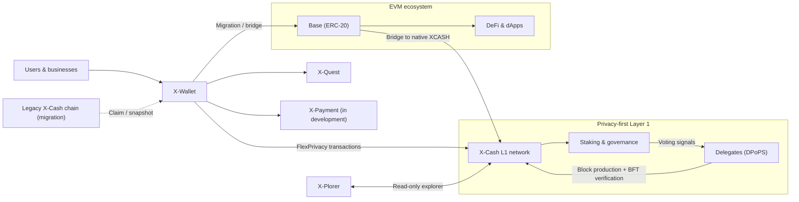

# X-Cash Documentation

X-Cash is a privacy-focused crypto ecosystem founded in **2018**. This repository contains the official documentation for users, node operators, delegates, and developers.

**X-Cash: Your money. Your privacy. Your governance.**

**Quick links**

* Website: [xcash.tech](https://xcash.tech)
* Migration portal: [xcash.tech/migration](https://xcash.tech/migration)
* Roadmap: [xcash.tech/roadmap](https://xcash.tech/roadmap)
* X-Wallet (web): [xwallet.xcash.tech](https://xwallet.xcash.tech)
* Explorer (X-Plorer): [xplorer.xcash.tech](https://xplorer.xcash.tech)
* GitHub org: [github.com/xcash-tech](https://github.com/xcash-tech)

## What X-Cash is building

X-Cash is designed as a **payment system first**: simple private payments for everyday users and small businesses, without requiring them to understand blockchain.

At the protocol level, X-Cash operates a privacy-focused **Layer-1** network with Monero-inspired (CryptoNote-based) privacy foundations. At the product level, X-Cash focuses on usability: one wallet, clear choices, and simple actions.

X-Cash is built as an ecosystem rather than a single product, with user experience as a core design principle.

Core pillars documented in this repo:

* **FlexPrivacy (Hybrid Transactions):** choose private or public transactions on the same network, on a per-transaction basis.
* **DPoPS (Delegated Proof of Private Stake):** a stake-based consensus designed for privacy coins, with delegate voting and BFT-style verification.
* **EVM interoperability:** built-in migration/bridging path to the EVM ecosystem (including Base) so X-Cash isn’t isolated from liquidity and applications.
* **Scalability & extensibility:** roadmap-aligned work including upgraded L1 infrastructure and future expansion paths.

If you're looking for the technical background, start with the papers:

* Hybrid Transactions: `Library → Yellowpaper - Hybrid Transactions`
* DPoPS design: `Delegate node & staking → Technical Design`

## Ecosystem components

X-Cash is intentionally packaged as a set of user-facing products on top of a privacy L1:

### Ecosystem map

Tip: if you use a Mermaid preview tool in VS Code, preview [ecosystem.mmd](ecosystem.mmd) (it contains plain Mermaid code). Some Mermaid previewers may try to parse the entire README (including the YAML frontmatter at the top) as a diagram.

### X-Wallet

X-Wallet is the primary interface of the ecosystem: a non-custodial browser wallet designed to make sending and managing assets understandable for non-technical users. It includes a privacy toggle, staking interface, and access to migration flows.

* Web wallet: [xwallet.xcash.tech](https://xwallet.xcash.tech)

### Privacy & transactions (FlexPrivacy)

FlexPrivacy (Hybrid Transactions) provides optional privacy in a unified model: users can choose **private** or **transparent** transactions from the same wallet UX, depending on context.

### EVM interoperability

X-Cash includes a native, built-in migration mechanism between:

* the X-Cash Layer-1 network
* the EVM ecosystem (including Base and other Ethereum-compatible chains)

This provides access to DeFi and liquidity when needed, while preserving the ability to return to the privacy-focused Layer-1.

### X-Payment (in development)

X-Payment is a payment system in development focused on real commerce: mobile-first payment flows, instant peer-to-peer payments, and merchant tooling for small and medium businesses.

### Supporting apps

* X-Plorer (explorer): [xplorer.xcash.tech](https://xplorer.xcash.tech)
* X-Quest (community): [xquest.xcash.tech](https://xquest.xcash.tech)

## Migration to the new X-Cash network (in progress)

X-Cash is currently running an **ongoing migration from the legacy blockchain to a new X-Cash network**. The migration is designed to be handled in the browser through X-Wallet, and the process is announced ahead of time (including the claim window).

High-level flow (see the official page for the latest details and timing):

1. **Open X-Wallet and claim** using your existing wallet credentials (you will need your 24/25-word seed phrase). Wait for full wallet sync.
2. **Receive new tokens on Base (ERC-20)** at a **1:1** ratio (for immediate liquidity and DeFi access while the new L1 launches).
3. **Legacy chain sunsets / new X-Cash L1 launches** with upgraded privacy layer and DPoPS consensus.
4. **Swap Base tokens → native XCASH on the new L1** via the built-in bridge to unlock full L1 features (privacy, staking, governance).
5. **Polygon WXCASH holders** can swap to the new Base token via X-Wallet.

Read the full process + FAQ: [xcash.tech/migration](https://xcash.tech/migration)

## Roadmap (where we’re headed)

The roadmap describes the project’s direction across three horizons:

* **Near-term (Foundation & Launch):** new X-Cash L1 network, token migration, community airdrop, Base integration, DAO activation, and an enhanced X-Wallet experience.
* **Mid-term (Scaling & Expansion):** higher-throughput scaling (zk-rollup L2), smart-contract sidechains, privacy-preserving DeFi primitives, and delegate performance tooling.
* **Long-term (Ecosystem maturity):** cross-chain swap protocol, expanded mobile wallet experiences, privacy-preserving NFTs, and additional privacy-first applications.

Latest roadmap status: [xcash.tech/roadmap](https://xcash.tech/roadmap)

## Get started

Use the table below to jump straight to what you need.

| What are you looking for? | Where to start |
| :--- | :--- |
| **I need to migrate legacy XCASH / WXCASH.** | Use the official [migration guide](https://xcash.tech/migration) |
| **I want to use a wallet.** | Web wallet: [xwallet.xcash.tech](https://xwallet.xcash.tech) • CLI wallet docs: [applications/xcash-wallet-cli.md](applications/xcash-wallet-cli.md) |
| **I want to connect to the network and run a node.** | Daemon documentation: [applications/xcashd.md](applications/xcashd.md) |
| **I want to stake / vote.** | Start here: [dpops/vote-and-staking.md](dpops/vote-and-staking.md) |
| **I want to become a delegate.** | Delegate guides: [dpops/get-started.md](dpops/get-started.md) and [dpops/server-setup.md](dpops/server-setup.md) |
| **I want to use RPC (wallet/daemon).** | RPC index: [applications/rpc-calls/README.md](applications/rpc-calls/README.md) |
| **I want to import/export a blockchain file.** | [applications/xcash-blockchain-export.md](applications/xcash-blockchain-export.md) and [applications/xcash-blockchain-import.md](applications/xcash-blockchain-import.md) |
| **I’m building and need API references.** | API section: [api/get-started.md](api/get-started.md) |

Tip: the full documentation navigation is in [SUMMARY.md](SUMMARY.md).

## Community & support

* Discord: [discord.gg/2bm4UuqYZT](https://discord.gg/2bm4UuqYZT)
* X (Twitter): [x.com/XcashTech](https://x.com/XcashTech)
* Telegram: [t.me/xcashtech](https://t.me/xcashtech)
* Reddit: [reddit.com/r/xcash](https://www.reddit.com/r/xcash)
* Explorer: [xplorer.xcash.tech](https://xplorer.xcash.tech)

## Contributing

Docs improvements, fixes, and updates are welcome.

* Contribution guidelines: [contribute/guidelines.md](contribute/guidelines.md)
* Bug bounty program: [contribute/bug-bounty-program.md](contribute/bug-bounty-program.md)

## Repository scope

This repository contains documentation. For source code and releases, see the GitHub organization:

* [github.com/xcash-tech](https://github.com/xcash-tech)

